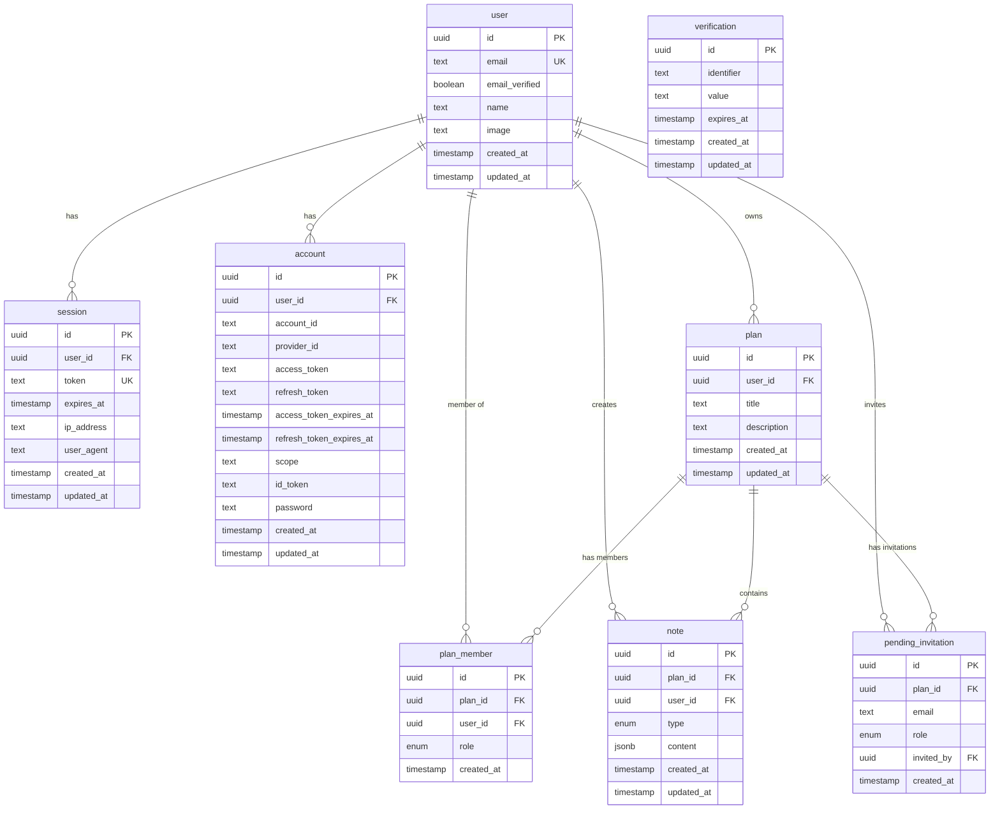

# Planit Database Design

Database schema design for the Planit collaborative planning app.

## Overview

PostgreSQL database with the following entities:

**Better Auth Core Tables:**
- **User** - User accounts
- **Session** - Active user sessions
- **Account** - OAuth providers and credentials (Google, Apple, email/password)
- **Verification** - Email verification and password reset tokens

**Application Tables:**
- **Plan** - Planning boards
- **Note** - Content within plans (single table with `type` field)
- **Plan Member** - Collaboration access control
- **Pending Invitation** - Invitations for unregistered users

---

## Entity Relationship Diagram

Tables use **singular** names (user, session, plan, note, etc.).



---

## Design Decisions

### 1. Authentication: Better Auth with OAuth

**Decision:** Use Better Auth with support for email/password, Google, and Apple sign-in.

**Rationale:**
- Single library handles all auth complexity
- Built-in OAuth support for social providers
- Session management included
- Account linking for users with multiple auth methods

**Supported Providers:**
- `credential` - Email and password
- `google` - Google OAuth
- `apple` - Apple Sign-In

### 2. Note Storage: Single Table with Type Field

**Decision:** Use a single `notes` table with a `type` field and JSONB `content` column.

**Rationale:**
- Simpler schema with fewer tables
- Easy to query all notes for a plan in one query
- Flexible content structure per type
- Adding new note types requires no schema migration
- Lower implementation effort

**Note Types:**
- `text` - Rich text notes
- `todo` - Checklist items
- `calendar` - Date range events
- `location` - Places with coordinates

### 3. Primary Keys: UUID v4

**Decision:** Use UUID v4 for all primary keys.

**Rationale:**
- Safe to expose in URLs (no enumeration attacks)
- Can be generated client-side for offline support
- No sequential ordering leaks information

### 4. Timestamps: created_at + updated_at

**Decision:** Include both `created_at` and `updated_at` on mutable entities.

**Exception:** `plan_members` and `pending_invitations` only have `created_at` since they are replaced rather than updated.

### 5. Deletion Strategy: Hard Delete with CASCADE

**Decision:** Use hard deletes with `ON DELETE CASCADE`.

**Cascade behavior:**
| When deleted | Also deleted |
|--------------|--------------|
| User | Sessions, accounts, plans, notes, memberships |
| Plan | Notes, members, pending invitations |

---

## Table Specifications

### Better Auth Tables

#### users

| Column | Type | Nullable | Default | Description |
|--------|------|----------|---------|-------------|
| id | uuid | No | gen_random_uuid() | Primary key |
| email | text | No | - | Unique email address |
| email_verified | boolean | No | false | Whether email is verified |
| name | text | Yes | - | Display name |
| image | text | Yes | - | Profile image URL |
| created_at | timestamptz | No | now() | Account creation |
| updated_at | timestamptz | No | now() | Last update |

**Constraints:**
- PK: `id`
- UNIQUE: `email`

---

#### sessions

| Column | Type | Nullable | Default | Description |
|--------|------|----------|---------|-------------|
| id | uuid | No | gen_random_uuid() | Primary key |
| user_id | uuid | No | - | FK to users |
| token | text | No | - | Unique session token |
| expires_at | timestamptz | No | - | Session expiry time |
| ip_address | text | Yes | - | Client IP address |
| user_agent | text | Yes | - | Client user agent |
| created_at | timestamptz | No | now() | Session creation |
| updated_at | timestamptz | No | now() | Last update |

**Constraints:**
- PK: `id`
- FK: `user_id` → `users.id` ON DELETE CASCADE
- UNIQUE: `token`

**Indexes:**
- `idx_sessions_user_id` on `user_id`
- `idx_sessions_token` on `token`

---

#### accounts

Stores authentication credentials and OAuth provider data.

| Column | Type | Nullable | Default | Description |
|--------|------|----------|---------|-------------|
| id | uuid | No | gen_random_uuid() | Primary key |
| user_id | uuid | No | - | FK to users |
| account_id | text | No | - | Provider's user ID |
| provider_id | text | No | - | Provider name |
| access_token | text | Yes | - | OAuth access token |
| refresh_token | text | Yes | - | OAuth refresh token |
| access_token_expires_at | timestamptz | Yes | - | Access token expiry |
| refresh_token_expires_at | timestamptz | Yes | - | Refresh token expiry |
| scope | text | Yes | - | OAuth scopes granted |
| id_token | text | Yes | - | OAuth ID token |
| password | text | Yes | - | Hashed password (credential only) |
| created_at | timestamptz | No | now() | Account creation |
| updated_at | timestamptz | No | now() | Last update |

**Constraints:**
- PK: `id`
- FK: `user_id` → `users.id` ON DELETE CASCADE
- UNIQUE: (`provider_id`, `account_id`)

**Provider IDs:**
- `credential` - Email/password authentication
- `google` - Google OAuth
- `apple` - Apple Sign-In

**Indexes:**
- `idx_accounts_user_id` on `user_id`
- `idx_accounts_provider` on (`provider_id`, `account_id`)

---

#### verifications

| Column | Type | Nullable | Default | Description |
|--------|------|----------|---------|-------------|
| id | uuid | No | gen_random_uuid() | Primary key |
| identifier | text | No | - | Email or other identifier |
| value | text | No | - | Verification token |
| expires_at | timestamptz | No | - | Token expiry |
| created_at | timestamptz | No | now() | Token creation |
| updated_at | timestamptz | No | now() | Last update |

**Indexes:**
- `idx_verifications_identifier` on `identifier`

---

### Application Tables

#### plans

| Column | Type | Nullable | Default | Description |
|--------|------|----------|---------|-------------|
| id | uuid | No | gen_random_uuid() | Primary key |
| user_id | uuid | No | - | Owner (FK to users) |
| title | text | No | - | Plan title (1-100 chars) |
| description | text | Yes | - | Plan description (max 500 chars) |
| created_at | timestamptz | No | now() | Creation time |
| updated_at | timestamptz | No | now() | Last update |

**Constraints:**
- PK: `id`
- FK: `user_id` → `users.id` ON DELETE CASCADE

**Indexes:**
- `idx_plans_user_id` on `user_id`
- `idx_plans_created_at` on `created_at`

---

#### notes

| Column | Type | Nullable | Default | Description |
|--------|------|----------|---------|-------------|
| id | uuid | No | gen_random_uuid() | Primary key |
| plan_id | uuid | No | - | FK to plans |
| user_id | uuid | No | - | Creator (FK to users) |
| type | text | No | - | Note type enum |
| content | jsonb | No | - | Type-specific content |
| created_at | timestamptz | No | now() | Creation time |
| updated_at | timestamptz | No | now() | Last update |

**Constraints:**
- PK: `id`
- FK: `plan_id` → `plans.id` ON DELETE CASCADE
- FK: `user_id` → `users.id` ON DELETE CASCADE
- CHECK: `type` IN ('text', 'todo', 'calendar', 'location')

**Indexes:**
- `idx_notes_plan_id` on `plan_id`
- `idx_notes_user_id` on `user_id`
- `idx_notes_type` on `type`

**Content Schemas:**

```typescript
// type: 'text'
{ title: string, text: string }

// type: 'todo'
{ title: string, items: [{ id, text, completed }] }

// type: 'calendar'
{ title: string, startDate?, endDate?, allDay? }

// type: 'location'
{ name: string, address?, coordinates?: { latitude, longitude }, notes? }
```

---

#### plan_members

| Column | Type | Nullable | Default | Description |
|--------|------|----------|---------|-------------|
| id | uuid | No | gen_random_uuid() | Primary key |
| plan_id | uuid | No | - | FK to plans |
| user_id | uuid | No | - | FK to users |
| role | text | No | - | Member role enum |
| created_at | timestamptz | No | now() | When joined |

**Constraints:**
- PK: `id`
- FK: `plan_id` → `plans.id` ON DELETE CASCADE
- FK: `user_id` → `users.id` ON DELETE CASCADE
- UNIQUE: (`plan_id`, `user_id`)
- CHECK: `role` IN ('owner', 'editor', 'viewer')

**Indexes:**
- `idx_plan_members_unique` on (`plan_id`, `user_id`)

---

#### pending_invitations

| Column | Type | Nullable | Default | Description |
|--------|------|----------|---------|-------------|
| id | uuid | No | gen_random_uuid() | Primary key |
| plan_id | uuid | No | - | FK to plans |
| email | text | No | - | Invitee email |
| role | text | No | - | Role to assign |
| invited_by | uuid | No | - | FK to users (inviter) |
| created_at | timestamptz | No | now() | When invited |

**Constraints:**
- PK: `id`
- FK: `plan_id` → `plans.id` ON DELETE CASCADE
- FK: `invited_by` → `users.id` ON DELETE CASCADE
- UNIQUE: (`plan_id`, `email`)
- CHECK: `role` IN ('editor', 'viewer')

**Indexes:**
- `idx_pending_invitations_unique` on (`plan_id`, `email`)
- `idx_pending_invitations_email` on `email`

---

## Index Strategy

| Table | Index | Columns | Purpose |
|-------|-------|---------|---------|
| sessions | idx_sessions_user_id | user_id | Find user's sessions |
| sessions | idx_sessions_token | token | Session lookup |
| accounts | idx_accounts_user_id | user_id | Find user's accounts |
| accounts | idx_accounts_provider | (provider_id, account_id) | OAuth lookup |
| verifications | idx_verifications_identifier | identifier | Token lookup |
| plans | idx_plans_user_id | user_id | List user's plans |
| plans | idx_plans_created_at | created_at | Sort plans by date |
| notes | idx_notes_plan_id | plan_id | List notes in plan |
| notes | idx_notes_user_id | user_id | Find user's notes |
| notes | idx_notes_type | type | Filter by note type |
| plan_members | idx_plan_members_unique | (plan_id, user_id) | Unique + access check |
| pending_invitations | idx_pending_invitations_unique | (plan_id, email) | Unique constraint |
| pending_invitations | idx_pending_invitations_email | email | Lookup on signup |

---

## Common Queries

### Get user's plans (owned + member of)

```sql
SELECT p.*, 
       COALESCE(pm.role, 'owner') as role
FROM plans p
LEFT JOIN plan_members pm ON pm.plan_id = p.id AND pm.user_id = :userId
WHERE p.user_id = :userId 
   OR pm.user_id = :userId
ORDER BY p.created_at DESC;
```

### Get all notes for a plan

```sql
SELECT * FROM notes 
WHERE plan_id = :planId
ORDER BY created_at;
```

### Check user access to plan

```sql
SELECT EXISTS (
  SELECT 1 FROM plans WHERE id = :planId AND user_id = :userId
  UNION
  SELECT 1 FROM plan_members WHERE plan_id = :planId AND user_id = :userId
) as has_access;
```

### Convert pending invitations on signup

```sql
-- In a transaction:
INSERT INTO plan_members (plan_id, user_id, role)
SELECT plan_id, :newUserId, role
FROM pending_invitations
WHERE email = :userEmail;

DELETE FROM pending_invitations WHERE email = :userEmail;
```

### Find user by OAuth provider

```sql
SELECT u.* FROM users u
JOIN accounts a ON a.user_id = u.id
WHERE a.provider_id = :providerId AND a.account_id = :accountId;
```

---

## Migration Notes

### Initial Setup

1. Create all tables with constraints
2. Create indexes
3. Add updated_at trigger function

```sql
CREATE OR REPLACE FUNCTION update_updated_at()
RETURNS TRIGGER AS $$
BEGIN
  NEW.updated_at = NOW();
  RETURN NEW;
END;
$$ LANGUAGE plpgsql;

-- Apply to each table with updated_at
CREATE TRIGGER update_users_updated_at
  BEFORE UPDATE ON users
  FOR EACH ROW EXECUTE FUNCTION update_updated_at();

CREATE TRIGGER update_sessions_updated_at
  BEFORE UPDATE ON sessions
  FOR EACH ROW EXECUTE FUNCTION update_updated_at();

CREATE TRIGGER update_accounts_updated_at
  BEFORE UPDATE ON accounts
  FOR EACH ROW EXECUTE FUNCTION update_updated_at();

CREATE TRIGGER update_verifications_updated_at
  BEFORE UPDATE ON verifications
  FOR EACH ROW EXECUTE FUNCTION update_updated_at();

CREATE TRIGGER update_plans_updated_at
  BEFORE UPDATE ON plans
  FOR EACH ROW EXECUTE FUNCTION update_updated_at();

CREATE TRIGGER update_notes_updated_at
  BEFORE UPDATE ON notes
  FOR EACH ROW EXECUTE FUNCTION update_updated_at();
```

### Future Considerations

1. **Soft delete** - Add `deleted_at` column if audit trail needed
2. **Full-text search** - Add GIN index on `content` for JSONB search
3. **Account linking** - Users can link multiple OAuth providers
